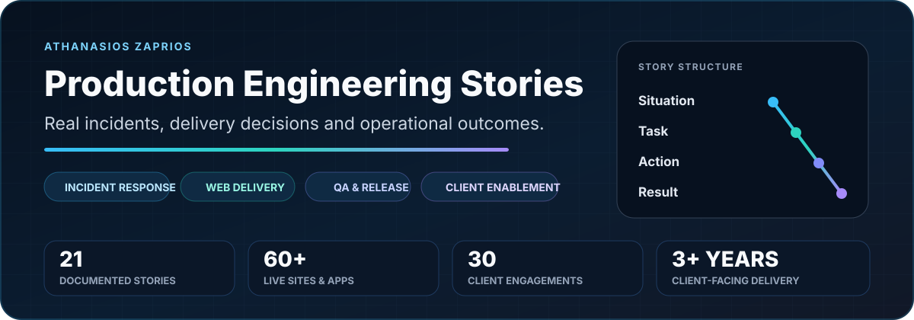

  

  <strong>First-hand accounts from supporting, testing, maintaining and improving production WordPress and WooCommerce platforms.</strong> 
  Real work · Sanitized details · Honest scope

  
  
  

> Each story follows a Situation–Task–Action–Result structure. The focus is on what I personally did, how I approached the work, what trade-offs or risks mattered and what changed. Client-sensitive data, credentials and private operational details are intentionally excluded.

## What this repository demonstrates

| Area | Evidence across the stories |
| --- | --- |
| **Incident response** | Reproduction, isolation, recovery planning, validation, stakeholder communication and safe relaunch |
| **Production operations** | Updates, caching, DNS, third-party services, performance, technical SEO and repeatable support practices |
| **WordPress / WooCommerce delivery** | Administration, integrations, catalogue operations, checkout, Site Editor and customer handover |
| **Quality assurance** | Regression checks, accessibility, release verification, defect reproduction and evidence capture |
| **Technical account delivery** | Requirements clarification, prioritization, client recovery, recommendations and long-term enablement |

## Featured stories

| Story | Outcome | What it demonstrates |
| --- | --- | --- |
| **[Critical malware recovery](stories/06-malware-recovery.md)** | Safely relaunched a compromised WordPress ecommerce site after clean recovery, credential rotation and full journey validation | Incident response, production ownership, stakeholder communication |
| **[WooCommerce operations and customer handover](stories/05-woocommerce-administration-handover.md)** | Established core workflows for a 2,000+ product store, configured the first 200 products and trained a previously non-technical owner | Ecommerce operations, enablement, ongoing support |
| **[PageSpeed improvement](stories/11-pagespeed-improvement.md)** | Increased a production store's PageSpeed score from below 20 to above 75 while preserving critical ecommerce journeys | Performance diagnosis, controlled change, regression testing |
| **[Recovering an unhappy client relationship](stories/17-client-relationship-recovery.md)** | Re-established confidence through clear ownership, evidence and follow-through | Communication, expectation management, trust recovery |

## Start here by role

| Role or interest | Recommended stories |
| --- | --- |
| **Technical Account Manager / Solutions Engineer** | [End-to-end client engagements](stories/07-end-to-end-client-engagements.md), [Ambiguous requirements](stories/14-ambiguous-requirements.md), [Client relationship recovery](stories/17-client-relationship-recovery.md) |
| **Application Support / Incident Response** | [Malware recovery](stories/06-malware-recovery.md), [Post-launch caching defect](stories/13-post-launch-caching-defect.md), [Recurring cache complaints](stories/19-recurring-cache-complaints.md) |
| **QA / Release Engineering** | [Controlled updates](stories/04-controlled-wordpress-updates.md), [Accessibility checkout defect](stories/10-accessibility-checkout-defect.md), [PageSpeed improvement](stories/11-pagespeed-improvement.md) |
| **WordPress / WooCommerce** | [Site Editor expertise](stories/02-wordpress-site-editor.md), [WooCommerce handover](stories/05-woocommerce-administration-handover.md), [Banking and checkout integration](stories/09-banking-checkout-integration.md) |

## Browse all 21 stories

### Production operations and reliability

1. [WordPress portfolio administration](stories/01-wordpress-portfolio-administration.md)
2. [Controlled WordPress updates](stories/04-controlled-wordpress-updates.md)
3. [Critical malware recovery and safe relaunch](stories/06-malware-recovery.md)
4. [DNS and third-party services](stories/08-dns-third-party-services.md)
5. [PageSpeed improvement](stories/11-pagespeed-improvement.md)
6. [Post-launch caching defect](stories/13-post-launch-caching-defect.md)
7. [Reducing recurring cache complaints](stories/19-recurring-cache-complaints.md)
8. [Repeatable support knowledge](stories/21-repeatable-support-knowledge.md)

### WordPress and WooCommerce delivery

9. [WordPress Site Editor expertise](stories/02-wordpress-site-editor.md)
10. [Payoneer and FunnelKit compatibility conflict](stories/03-payoneer-funnelkit-conflict.md)
11. [WooCommerce administration and customer handover](stories/05-woocommerce-administration-handover.md)
12. [Banking and checkout integration](stories/09-banking-checkout-integration.md)
13. [Technical SEO implementation](stories/12-technical-seo.md)

### Quality assurance and accessibility

14. [Accessibility-related checkout defect](stories/10-accessibility-checkout-defect.md)

### Consulting and client delivery

15. [End-to-end client engagements](stories/07-end-to-end-client-engagements.md)
16. [Creating structure from an ambiguous request](stories/14-ambiguous-requirements.md)
17. [Prioritization under competing demands](stories/15-competing-priorities.md)
18. [Delivering beyond the original request](stories/16-beyond-original-request.md)
19. [Recovering an unhappy client relationship](stories/17-client-relationship-recovery.md)
20. [Proactive business-value recommendation](stories/18-business-value-recommendation.md)

### Responsible work methods

21. [Responsible AI-assisted delivery](stories/20-ai-assisted-productivity.md)

## Evidence boundaries

- These are true accounts of work I performed. They are not presented as sole ownership of every wider client engagement.
- Figures appear only where I can substantiate them from the engagement, including 60 supported sites, a 2,000+ product catalogue, the first 200 products configured, approximately 30 client engagements and the reported PageSpeed change.
- Public websites are named only when doing so helps explain the context. Private logs, customer data, security details, credentials and internal documentation are not published.
- Where public code exists, it is linked from my [GitHub profile](https://github.com/zpthanos). These stories complement that code by showing production judgment, communication and operational responsibility.

## About me

I am a technical delivery professional focused on application support, WordPress/WooCommerce, QA and production operations. I work across issue reproduction, requirements, integrations, functional and regression testing, releases, incident recovery, documentation and user handover.

  <a href="https://github.com/zpthanos"><strong>View my GitHub profile</strong></a>

